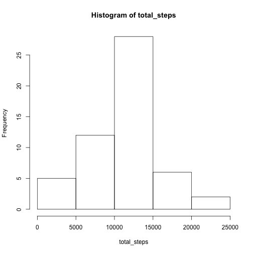
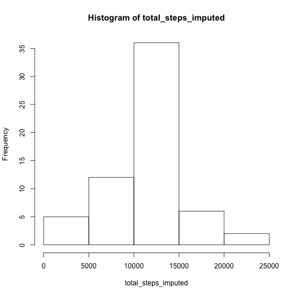
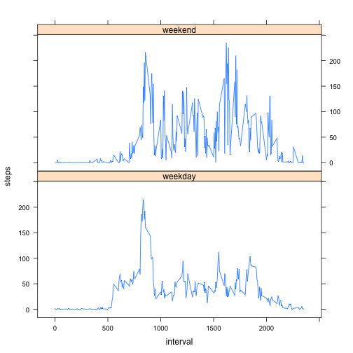

Load all packages needed for analysis & presentation


```r
library(data.table)
library(dplyr)
library(plyr)
library(lattice)
library(ggplot2)
```

Loading and formatting the date field


```r
activity = read.csv("activity.csv")
activity$date <- as.Date(activity$date)
```
What is mean total number of steps taken per day (excluding NA values)?
1. Histogram of total number of steps per day
2. Mean & Median of the total number of steps taken per day


```r
activity1 <- na.omit(activity)
total_steps <- tapply(activity1$steps, activity1$date, sum)
hist(total_steps)
```

 

```r
mean(total_steps)
```

```
## [1] 10766.19
```

```r
median(total_steps)
```

```
## [1] 10765
```

What is the average daily activity pattern?
1. Time series plot of 5-minute interval & average steps taken across all days
2. The 5-min interval on average that contains the max number of steps is 835.


```r
avg_steps <- aggregate(steps ~ interval, data = activity, FUN = mean, na.rm=TRUE)
xyplot (steps ~ interval, data=avg_steps, type="l")
```

 

```r
max_no_of_steps <- avg_steps$interval[which.max(avg_steps$steps)]
max_no_of_steps
```

```
## [1] 835
```

Imputing missing values
1. Calculate & report Total number of missing values in dataset
2. Fill in missing values using the average steps for each interval across all days
3. Create a new dataset with missing values filled in (activity2)
4. Histogram of total steps per day after missing values filled in.  Mean & median total steps per day.  Do these values differ from earlier estimates?  What is the impact of imputing missing data on total daily number of steps?


```r
missing_val <- sum(is.na(activity))
missing_val
```

```
## [1] 2304
```

```r
stepsavg <- aggregate(steps ~ interval, data = activity, FUN = mean, na.rm=TRUE)
stepsavg$steps <- round(stepsavg$steps)
stepsavg <- rename(stepsavg, c("steps" = "avg"))
activity2 <- merge(activity, stepsavg)
for(i in 1:nrow(activity2)){
  if(is.na(activity2$steps[i])==1) {
     activity2$steps[i] <- activity2$avg[i]
  }
}
total_steps_imputed <- tapply(activity2$steps, activity2$date, sum)
hist(total_steps_imputed)
```

 

```r
mean(total_steps_imputed)
```

```
## [1] 10765.64
```

```r
median(total_steps_imputed)
```

```
## [1] 10762
```

```r
mean_diff <- mean(total_steps) - mean(total_steps_imputed)
mean_diff
```

```
## [1] 0.549335
```

```r
median_diff <- median(total_steps) - median(total_steps_imputed)
median_diff
```

```
## [1] 3
```

```r
total_diff <- sum(total_steps) - sum(total_steps_imputed)
total_diff
```

```
## [1] -86096
```

Are there differences in activity patterns between weekdays & weekends?
1. Create a new factor variable with 2 levels "weekday" and "weekend"
2. Make a panel plot containing a time-series plot of the 5-min interval & average steps taken


```r
activity2$wkday <- as.factor(ifelse(weekdays(activity2$date) == c("Saturday","Sunday"),"weekend","weekday"))
no_of_steps <- aggregate(steps ~ interval+wkday, data = activity2, FUN = mean, na.rm=TRUE)
xyplot (steps ~ interval | wkday, data=no_of_steps, type="l", layout=c(1,2))
```

 
